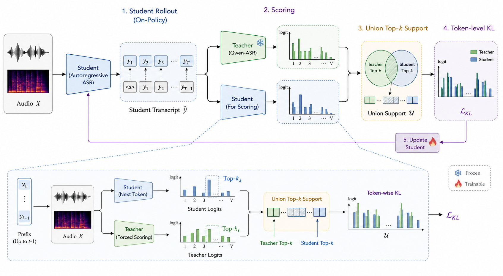

<div align="center">

# open-audio-opd: Industrial Audio Online Policy Distillation

**Industrial audio OPD training stack for ASR and TTS, distilling compact audio models from stronger teacher models.**

[](https://github.com/AutoArk/open-audio-opd)
[](https://huggingface.co/AutoArk-AI/ARK-ASR-0.6B)
[](paper/arxiv_ark_asr_opd/main.pdf)
[](LICENSE)

中文文档: [README_zh.md](README_zh.md)

</div>

<details open>
<summary><strong>Announcements</strong></summary>

<div style="max-height: 150px; overflow-y: auto; border: 1px solid #ddd; padding: 10px; margin-top: 8px;">

- **2026.05.25: open-audio-opd is available on GitHub.**
  The repository contains the industrial ASR online policy distillation training stack with FSDP2 distributed training.

- **2026.05.25: ARK-ASR-0.6B model weights are available.**
  Download the compact ASR student checkpoint from [Hugging Face](https://huggingface.co/AutoArk-AI/ARK-ASR-0.6B).

- **TTS OPD is on the roadmap.**
  The planned TTS recipe will reuse online student rollout and teacher scoring, adapted for speech generation quality, alignment, and acoustic-token supervision.

</div>

</details>

<br>

## Abstract

`open-audio-opd` contains the production audio online policy distillation
(OPD) stack used to distill compact audio models from stronger teacher models.
The current release focuses on ASR: a student autoregressive ASR model rolls out
transcripts on-policy, a stronger teacher scores the same audio and transcript,
and the student is updated with token-level KL on the union top-k support.

The repository is based on [THUNLP/OPD](https://github.com/thunlp/OPD/) and
[verl](https://github.com/volcengine/verl). A trimmed vendored copy of `verl/`
is included so the training script can use FSDP2 wrapping, gradient clipping,
and checkpoint management without depending on another local checkout.

No audio files, JSONL datasets, or private machine paths are included. All
model, data, and output paths are explicit command-line arguments. ASR model
weights are released separately as
[AutoArk-AI/ARK-ASR-0.6B](https://huggingface.co/AutoArk-AI/ARK-ASR-0.6B).

<br>

<div align="center" style="margin: 20px 0 24px;">
  
  <br>
  <sub><strong>Figure 1.</strong> Audio OPD trains a compact student from online rollouts and teacher scoring over union top-k token support.</sub>
</div>

<br>

<div align="center">

[Roadmap](#roadmap) · [Model Release](#model-release) · [Experimental Results](#experimental-results) · [Training Method](#training-method) · [Install](#install) · [Inference](#inference) · [Evaluation](#evaluation) · [Training](#single-node-training)

</div>

## Roadmap

| Category | Item | Status |
| :--- | :--- | :---: |
| **ASR OPD** | FSDP2 online policy distillation trainer | Done |
| | Qwen3-ASR-style teacher scoring backend | Done |
| | Resumeable FSDP2 checkpointing | Done |
| | Multi-node hostfile launcher | Done |
| | ASR inference and J/WER evaluation scripts | Done |
| **Model Releases** | [ARK-ASR-0.6B](https://huggingface.co/AutoArk-AI/ARK-ASR-0.6B) | Done |
| **TTS OPD** | Online rollout and teacher-scoring recipe | Planned |
| | Speech generation quality and alignment objectives | Planned |
| | Acoustic-token supervision support | Planned |

## Model Release

<div align="center">

| | ARK-ASR-0.6B |
| :--- | :--- |
| **Checkpoint** | [AutoArk-AI/ARK-ASR-0.6B](https://huggingface.co/AutoArk-AI/ARK-ASR-0.6B) |
| **Task** | Autoregressive ASR |
| **Languages** | Chinese, English, German, Japanese, French, Korean |
| **Training recipe** | SFT baseline plus teacher-data adaptation and OPD |
| **Repository use** | Inference, evaluation, and OPD continued training workflows |

</div>

## Repository Layout

```text
scripts/train/train_ark_asr_opd_fsdp2_resume.py      # main FSDP2 ASR OPD trainer
scripts/run/run_ark_asr_opd_fsdp2_resume_hostfile.sh # multi-node launcher
scripts/infer/ark_asr_transformers.py                # ASR inference
scripts/eval/eval_jwer_ark_asr_transformers.py       # J/WER evaluation
scripts/eval/run_arkasr_eval.sh                      # multi-GPU evaluation launcher
configs/hostfile.example                             # hostfile format example
paper/arxiv_ark_asr_opd/main.pdf                     # paper PDF
assets/opd_overview.png                              # OPD overview figure
verl/                                                # vendored verl runtime code
README.md / README_zh.md                             # usage docs
```

## Experimental Results

Ark-ASR is a 0.6B-parameter ASR student model. These OPD experiments use only
100k hours of ASR audio. Public Qwen3-ASR technical-report material reports
that Qwen3-ASR uses a multi-stage training pipeline whose AuT encoder
pretraining stage alone uses about 40M hours of pseudo-labeled ASR audio,
followed by Omni training, ASR SFT, and ASR RL. Under this comparison, Ark-ASR
uses roughly 1/400 of the disclosed ASR pretraining audio scale while reaching
a comparable level to the Qwen3-ASR 0.6B baseline.

`Ark-Base` denotes the 0.6B checkpoint obtained by SFT on the 100k-hour ASR
dataset. `TD` denotes teacher-data adaptation using 2,000 hours of
teacher-generated ASR data. `OPD` denotes on-policy distillation with the
Qwen-ASR teacher.

| Model | aishell-1 (CER) | Wenet-meeting (CER) | Wenet-net (CER) | Libri-clean (WER) | Libri-other (WER) |
| --- | ---: | ---: | ---: | ---: | ---: |
| Ark-Base (0.6B) | 3.48% | 10.22% | 7.74% | 3.75% | 7.17% |
| Ark-Base+OPD (0.6B) | 3.00% | 7.18% | 6.13% | 2.88% | 5.50% |
| Ark-Base+TD+OPD (0.6B) | 1.95% | 5.92% | 5.39% | 2.45% | 4.56% |
| Qwen3-ASR-1.7B | 1.50% | 4.69% | 4.55% | 2.20% | 4.05% |
| Qwen3-ASR-0.6B | 2.07% | 5.57% | 5.45% | 2.81% | 5.05% |

Lower CER/WER is better.

Key takeaways:

- With only 100k hours of audio, Ark-ASR reaches a competitive level against
  Qwen3-ASR models trained with a much larger reported ASR data scale.
- Applying OPD on the same 0.6B student substantially improves every benchmark
  over Ark-Base, showing that OPD transfers additional ASR capability beyond
  standard supervised fine-tuning.
- Ark-Base+TD+OPD is the stronger recipe. It improves Ark-ASR from 3.00% to
  1.95% CER on aishell-1, from 7.18% to 5.92% CER on Wenet-meeting, from 6.13%
  to 5.39% CER on Wenet-net, from 2.88% to 2.45% WER on Libri-clean, and from
  5.50% to 4.56% WER on Libri-other.
- At the same 0.6B scale, Ark-Base+TD+OPD is stronger overall than
  Qwen3-ASR-0.6B, with better aishell-1, Wenet-net, Libri-clean, and
  Libri-other results.

## Training Method

ASR OPD trains a student ASR model using online rollouts and teacher scores:

```text
audio batch
  -> student generates transcript tokens with no grad
  -> teacher scores the same audio plus the student transcript
  -> student scores its own transcript with gradients
  -> build teacher/student union top-k support
  -> optimize KL(teacher || student) on aligned transcript positions
  -> save FSDP2 checkpoints that can be resumed
```

The key point is that the teacher is not used to provide a static transcript
label. It scores what the student actually generated online, so the student is
trained on its own current behavior.

### Student And Teacher

`--student_model` is the trainable audio-capable ASR model. It must be loadable
with `AutoModelForCausalLM.from_pretrained(..., trust_remote_code=True)` and its
processor/tokenizer must support the audio prompt format used by the script.
The student is wrapped with FSDP2 and receives gradients.

`--teacher_model` is the stronger ASR model used for scoring. It is loaded in
eval mode and does not receive gradients. Supported teacher backends are:

- `qwen3_asr_teacher_forcing`: default production path for Qwen3-ASR-style teachers.
- `qwen3_asr_transformers`: Transformers backend for Qwen3-ASR.
- `qwen3_asr_vllm`: vLLM backend when the matching vLLM stack is installed.
- `hf_causal_lm`: generic Hugging Face causal LM teacher path.

For `qwen3_asr_*` backends, pass `--qwen3_asr_code_path` to the local Qwen3-ASR
Transformers backend code. That backend code is not vendored here.

## Install

Use a CUDA/PyTorch environment that matches your cluster. Then install this
repository and its Python dependencies:

```bash
pip install -e .
```

If your workflow expects `verl` to be installed as its own editable package:

```bash
pip install -e ./verl
```

For `qwen3_asr_vllm`, install a compatible vLLM stack separately:

```bash
pip install -e ".[vllm]"
```

## Data Format

Training data is JSONL. Each line is one ASR sample:

```json
{"audio":"/path/to/audio.wav","text":"reference transcript","task":"asr","begin_time":-1,"end_time":-1}
```

Fields:

- `audio`: required audio path.
- `text`: required reference transcript used for ASR supervision and metadata.
- `task`: optional; if present, it must be `asr`.
- `begin_time`: optional segment start in seconds. Use `-1` for full audio.
- `end_time`: optional segment end in seconds. Use `-1` for full audio.

The script fails on missing audio paths. It does not silently replace bad
samples with fallback audio.

## Inference

Run ASR inference with Hugging Face Transformers:

```python
import torch
from transformers import AutoModelForCausalLM, AutoProcessor, AutoTokenizer

model_path = "AutoArk-AI/ARK-ASR-0.6B"
audio_path = "https://huggingface.co/datasets/hf-internal-testing/dummy-audio-samples/resolve/main/bcn_weather.mp3"

device = "cuda" if torch.cuda.is_available() else "cpu"
torch_dtype = torch.float16 if device == "cuda" else torch.float32

processor = AutoProcessor.from_pretrained(model_path, trust_remote_code=True)
tokenizer = AutoTokenizer.from_pretrained(model_path, trust_remote_code=True)
model = AutoModelForCausalLM.from_pretrained(
    model_path,
    trust_remote_code=True,
    torch_dtype=torch_dtype,
    attn_implementation="sdpa",
).to(device)

conversation = [
    {
        "role": "user",
        "content": [
            {"type": "audio", "path": audio_path},
            {"type": "text", "text": "Please transcribe this audio."},
        ],
    }
]

inputs = processor.apply_chat_template(
    conversation,
    add_generation_prompt=True,
    return_tensors="pt",
)
inputs = inputs.to(device)
if "audios" in inputs:
    inputs["audios"] = inputs["audios"].to(dtype=torch_dtype)

eos_token_ids = [tokenizer.eos_token_id]
for token in ["<|user|>", "<|assistant|>", "<|im_end|>"]:
    token_id = tokenizer.convert_tokens_to_ids(token)
    if isinstance(token_id, int) and token_id >= 0:
        eos_token_ids.append(token_id)

outputs = model.generate(
    **inputs,
    do_sample=False,
    max_new_tokens=256,
    pad_token_id=tokenizer.pad_token_id,
    eos_token_id=list(dict.fromkeys(eos_token_ids)),
)
decoded_outputs = tokenizer.batch_decode(
    outputs[:, inputs.input_ids.shape[1] :],
    skip_special_tokens=True,
)
print(decoded_outputs)
```

For batch JSONL inference, use:

```bash
python scripts/infer/ark_asr_transformers.py \
  --input /path/to/input.jsonl \
  --output runs/infer/predictions.jsonl \
  --model_path AutoArk-AI/ARK-ASR-0.6B \
  --processor_path AutoArk-AI/ARK-ASR-0.6B \
  --batch_size 40 \
  --dtype float16 \
  --attn_impl sdpa
```

## Evaluation

Run J/WER evaluation for one JSONL file:

```bash
python scripts/eval/eval_jwer_ark_asr_transformers.py \
  --input /path/to/test_aishell.jsonl \
  --output runs/eval/test_aishell_result.jsonl \
  --model_path AutoArk-AI/ARK-ASR-0.6B \
  --processor_path AutoArk-AI/ARK-ASR-0.6B \
  --batch_size 40 \
  --dtype float16 \
  --attn_impl sdpa
```

The eval output is sorted by `cer_errors` descending to make bad cases easy to
inspect. Each row includes `ref_text`, `pred_text`, cleaned text fields,
`wer_errors`, `cer_errors`, `ref_words`, and `ref_chars`.

If your environment has the `text_process` normalizer in a separate Python env,
pass:

```bash
--text_normalize_python /path/to/wetext/bin/python
```

For the five-preset multi-GPU evaluation pattern used by the internal
`run_arkasr_step30000_eval.sh`, use the open-source launcher without hard-coded
data paths:

```bash
MODEL_PATH=AutoArk-AI/ARK-ASR-0.6B \
EVAL_DATA_DIR=/path/to/eval_jsonl_dir \
OUTPUT_DIR=runs/eval/arkasr_step30000 \
SUFFIX=step30000 \
GPUS="0 1 2 3 4" \
PRESETS="aishell clean meeting net other" \
scripts/eval/run_arkasr_eval.sh
```

The launcher expects files named `test_${preset}.jsonl` under `EVAL_DATA_DIR`.
It writes logs, pid files, and result JSONL files to `OUTPUT_DIR`. No eval data
is included in this repository.

## Single-Node Training

```bash
torchrun --nproc_per_node 8 scripts/train/train_ark_asr_opd_fsdp2_resume.py \
  --student_model AutoArk-AI/ARK-ASR-0.6B \
  --teacher_model /path/to/qwen3_asr_model \
  --qwen3_asr_code_path /path/to/qwen3-asr/backend \
  --train_data /path/to/train.jsonl \
  --output_dir runs/ark_asr_opd_fsdp2 \
  --teacher_backend qwen3_asr_teacher_forcing \
  --calibrate_only False \
  --per_device_train_batch_size 1 \
  --learning_rate 1e-6 \
  --opd_top_k 32 \
  --asr_opd_max_new_tokens 256 \
  --save_freq 1000
```

Start with a small batch and small `--asr_opd_max_new_tokens`, then scale after
checking generation length, non-empty generation ratio, teacher alignment, and
`opd_valid_topk_mean`.

## Multi-Node Hostfile Launch

Create a hostfile:

```text
node0 slots=8
node1 slots=8
node2 slots=8
```

Launch:

```bash
HOSTFILE=/path/to/hostfile \
STUDENT_MODEL=AutoArk-AI/ARK-ASR-0.6B \
TEACHER_MODEL=/path/to/qwen3_asr_model \
QWEN3_ASR_CODE_PATH=/path/to/qwen3-asr/backend \
TRAIN_DATA=/path/to/train.jsonl \
OUTPUT_DIR=runs/ark_asr_opd_fsdp2 \
NCCL_SOCKET_IFNAME=hpn0 \
GLOO_SOCKET_IFNAME=hpn0 \
scripts/run/run_ark_asr_opd_fsdp2_resume_hostfile.sh
```

The launcher requires `HOSTFILE`, `STUDENT_MODEL`, `TEACHER_MODEL`, and
`TRAIN_DATA`. It also requires `QWEN3_ASR_CODE_PATH` when `TEACHER_BACKEND`
starts with `qwen3_asr_`.

## Resume Training

Resume a specific checkpoint:

```bash
torchrun --nproc_per_node 8 scripts/train/train_ark_asr_opd_fsdp2_resume.py \
  --student_model AutoArk-AI/ARK-ASR-0.6B \
  --teacher_model /path/to/qwen3_asr_model \
  --qwen3_asr_code_path /path/to/qwen3-asr/backend \
  --train_data /path/to/train.jsonl \
  --output_dir runs/ark_asr_opd_fsdp2 \
  --resume_from_checkpoint runs/ark_asr_opd_fsdp2/checkpoints/global_step_1000 \
  --calibrate_only False
```

Resume the latest checkpoint under `output_dir/checkpoints`:

```bash
--resume_from_checkpoint latest
```

`auto` is accepted as an alias for `latest`.

## Calibration Mode

By default, `--calibrate_only True`. Calibration runs forward passes and prints
initial loss/generation metrics without optimizer steps. Use it before a real
run to verify model loading, data loading, rollout, teacher scoring, and OPD
alignment.

For actual training, pass:

```bash
--calibrate_only False
```

## Important Arguments

- `--student_model`: trainable student ASR model path or HF repo id.
- `--teacher_model`: teacher ASR model path or HF repo id.
- `--teacher_backend`: teacher scoring implementation.
- `--qwen3_asr_code_path`: required for Qwen3-ASR teacher backends.
- `--train_data`: JSONL training data.
- `--output_dir`: logs and FSDP2 checkpoints.
- `--hf_cache_dir`: Hugging Face datasets cache directory.
- `--opd_top_k`: teacher/student top-k support size.
- `--opd_temperature`: temperature for OPD distribution.
- `--asr_block_token_id_from`: masks non-ASR token ids during student generation.
- `--asr_opd_max_new_tokens`: rollout length cap.
- `--save_freq`: checkpoint save interval. Set `-1` to disable saving.
- `--resume_from_checkpoint`: checkpoint dir, `latest`, or `auto`.

## Smoke Checks

These checks do not require model weights:

```bash
python3 -m py_compile scripts/train/train_ark_asr_opd_fsdp2_resume.py
python3 -m py_compile scripts/infer/ark_asr_transformers.py
python3 -m py_compile scripts/eval/eval_jwer_ark_asr_transformers.py
bash -n scripts/run/run_ark_asr_opd_fsdp2_resume_hostfile.sh
bash -n scripts/eval/run_arkasr_eval.sh
python scripts/train/train_ark_asr_opd_fsdp2_resume.py --help
```

The final `--help` command must be run in an environment with the training
dependencies installed, including `numpy`, `torch`, `datasets`,
`transformers`, `omegaconf`, and the `verl` dependencies listed in
`pyproject.toml`.
